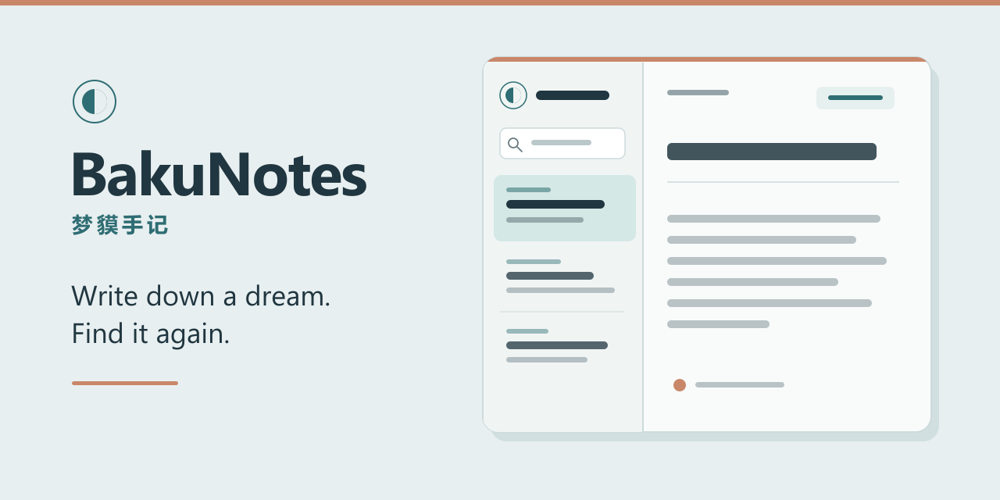

# BakuNotes

[English](README.md)

BakuNotes（梦貘手记）是一款本地优先的梦境日记，用于记下梦、找回旧记录，并保留独立备份。它也能把受支持的笔记导出格式转换为 BakuNotes 记录。Expo 项目让网页与 iOS 共用一份代码。



> **当前状态：**本地记录、搜索、JSONL 导入导出及 ENEX 转换已经实现；其他笔记格式仍在规划中。Supabase 加密同步已有代码，但尚未在真实设备之间验收；目前也没有已部署网页或签名的 iPhone 安装包。

## 本机试用

需要 Node.js 和 npm；本地使用不需要云端账号。

```sh
cd app
npm ci
npm run web
```

新建梦境后，可以随时补充标题或日期，并按标题或正文搜索。记录保存在当前设备。使用“导出备份”下载 JSONL 副本，再用“导入记录”恢复备份或导入转换后的笔记；相同 ID 的记录不会重复导入。

## 从 ENEX 转换笔记

首个支持的来源格式是印象笔记使用的 ENEX。请在来源应用中导出文件；BakuNotes 不负责执行该导出。转换器读取已有文件，不修改原件，并生成 BakuNotes JSONL、manifest 和一份来源文件副本。

```sh
python tools/convert_enex.py --input "path/to/notes.enex" --output "private/enex-conversion"
python tools/verify_conversion.py --archive "private/enex-conversion"
```

输出目录必须为空。导入应用前请复核 `dreams.jsonl`：传入的 ENEX 中每篇笔记都会转换，不会自动判断是否为梦境。转换器保存附件文件和元数据；应用目前只导入文字记录与元数据，不会把附件文件带入日记。格式约定及后续格式类别见[转换说明](CONVERSION.md)。[印象笔记帮助中心](https://help.yinxiang.com/hc/articles/63067)说明了其客户端的 ENEX 导出能力。

## 隐私与备份

设备缓存和导出的 JSONL 备份都是**明文**，请放在受保护的位置，并实际试做恢复。云同步会在上传前于客户端加密记录字段，但仍需真实设备验收；详见[云端配置](CLOUD_SETUP.md)。个人来源文件应放在被 Git 忽略的 `archive/` 或 `private/`，不属于公开仓库内容。

## 项目文件

- `app/` — Expo / React Native 日记、本地存储、备份导入导出和加密同步代码。
- `tools/` — 处理已有笔记导出文件的转换器及校验工具。
- `supabase/schema.sql` — 密文记录表及行级安全规则。
- [架构](ARCHITECTURE.md)、[roadmap](PLAN.md)与[领域术语](CONTEXT.md) — 设计和后续工作。
- [iPhone 构建条件](IOS_BUILD.md) — 获得可安装签名包的条件。

## 检查命令

从仓库根目录执行：

```sh
cd app
npm run lint
npx tsc --noEmit
npx expo export --platform web
cd ..
python -m unittest discover -s tools -p 'test_*.py'
```

仓库目前没有覆盖整个项目的开源许可证。
